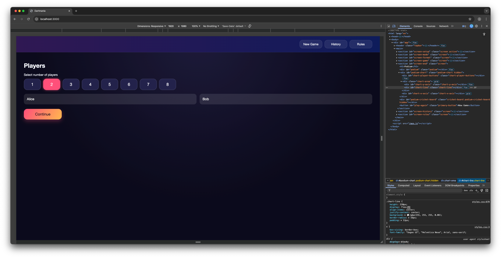
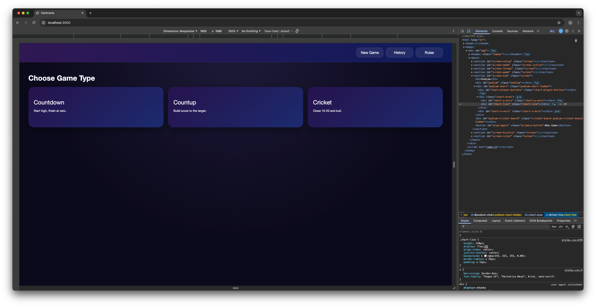
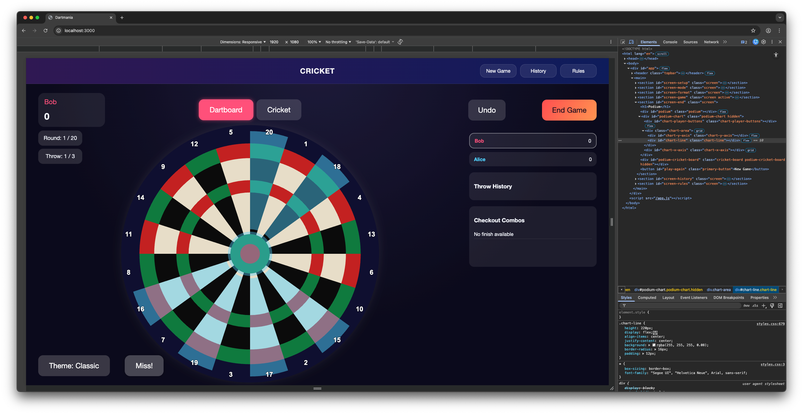
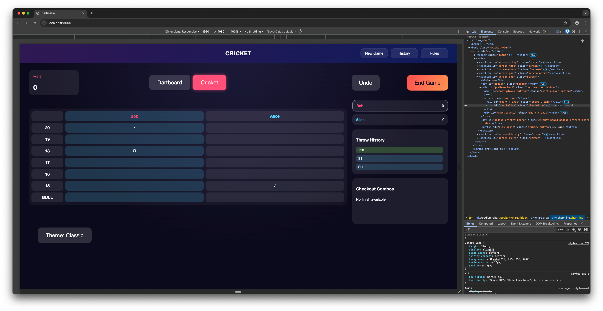
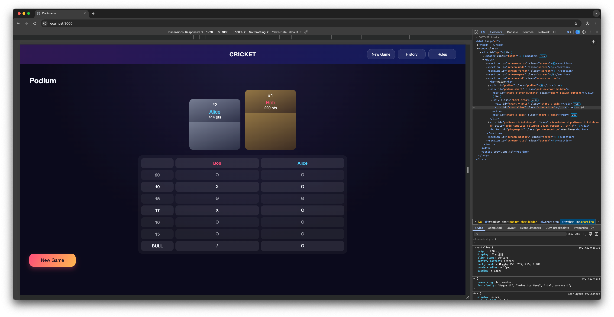
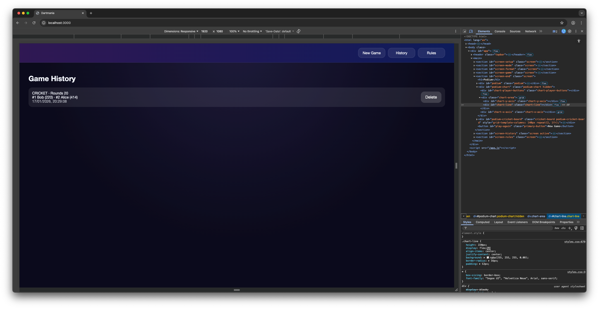
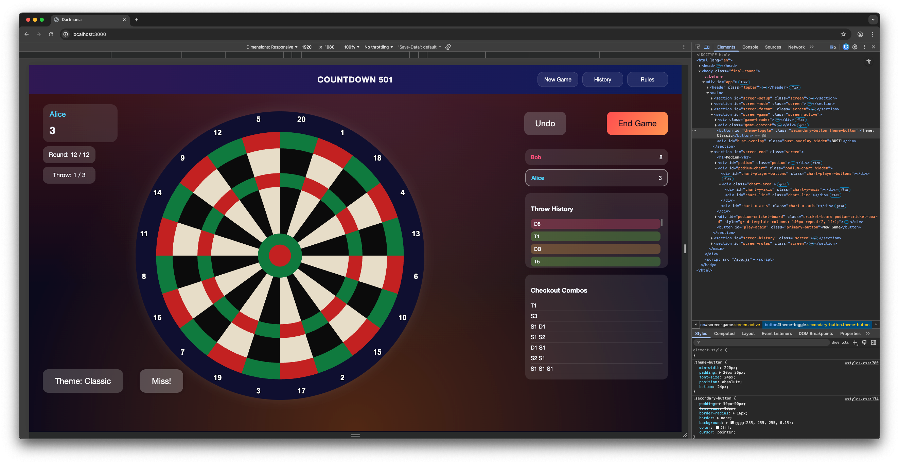
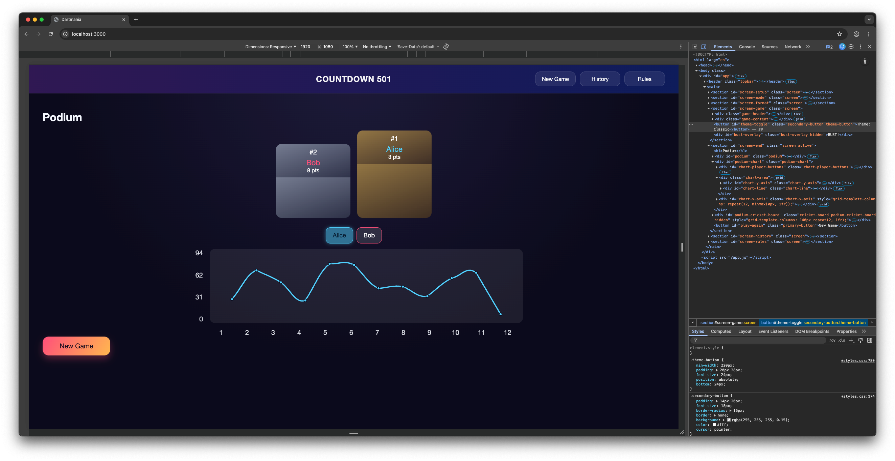

# Dartmania

Dartmania is a touchscreen-friendly darts scoring app for home or bar play.
It supports creating games, recording throws, undoing throws, ending games,
and browsing/deleting game history.

## Features
- Create a game with up-to 8 players and options (mode, format, rounds, double-out)
- Record throws and keep live scores
- Undo the last throw
- End a game and review history

## Build and Run (Docker)
```
docker build -t dartmania .
docker run --rm -p 8003:8003 -v dartmania-data:/data dartmania
```

## UI Target
Designed for a 1920x1080 touchscreen layout.

## Simple Architecture
- Node/Express server serves the static UI from `public/`
- REST endpoints under `/api` manage game state
- SQLite database stored at `DB_PATH` (default `/data/dartmania.sqlite`)

## Screenshots








